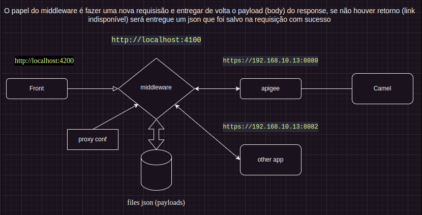
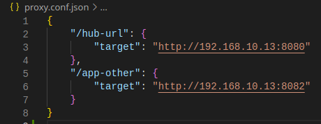

# Interception API

> Um middleware para interceptar as requests
>
> Se houver uma falha no request ou response será entregue um payload (json) correspondente ao path
>
> Está aplicação irá compor uma URL com base na primeira parte do endpoint, usando como base um arquivo de configuração (json).



- Crie um arquivo proxy.conf.json com a mesma estrutura abaixo



> Onde as target uri ('/hub-url') definiram a base URL para request
>
> Este projeto foi configurado para executar com o Node 10.24.1

- Crie um arquivo '.env' com base no modelo '.env.example'

```
cat .env.example >> .env
```

- Instale as dependências

```
yarn
```

- Start na aplicação

```
yarn start
```
